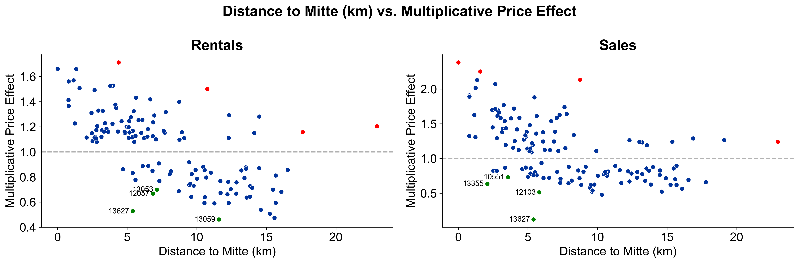

# BerlinRealEstatePrices 🡠
Statistical analysis of Berlin real estate prices for [IDS702 class](https://ids702-f21.olanrewajuakande.com) @ Duke University.

> **Research Question**  
> Which factors influence listing prices of Berlin real estate?

# Methodology 🛠️
- Web scraping data from `immobilienscout24.de`, `immowelt.de`, and `ebay-kleinanzeigen.de`
- Data cleaning
- Modeling
  - Linear Regression
  - Hierarchical linear model with random intercepts
 
 # Results
*You can download the full report [here](https://github.com/moritzwilksch/BerlinRealEstatePrices/raw/main/documents/report.pdf). It highlights...*
### The relationship between property attributes and price
> 🔑 Take aways:

- larger properties are more expensive
- temporary living is overpriced (although you pay for flexibility...)
- houses (compared to apartments, everything else held constant) are significantly more expensive to rent, but cheaper to buy
- offers from private sellers and landlords tend to be cheaper than offers from commercial entities

### The importance of location
> 🔑 Take away: Properties in the city center are more expensive

### Zip code areas that are "cheap" considering their proximity to the city center
> 🔑 Take away: Some zip code areas offer good value for money if you want to be close to the action

