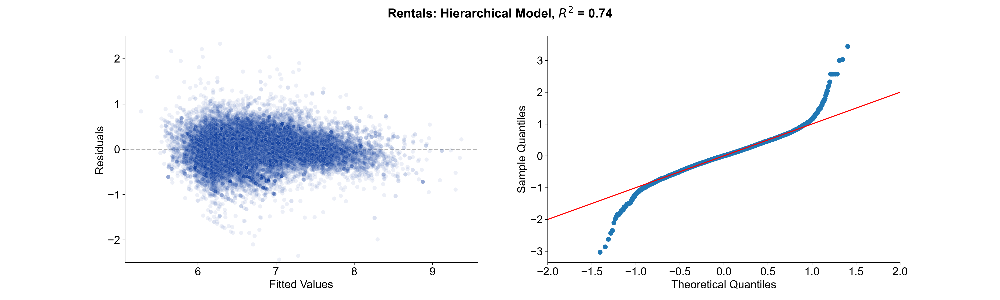

```{r setup, include=FALSE}
knitr::opts_chunk$set(
	echo = FALSE,
	message = FALSE,
	warning = FALSE
)

# knitr::opts_chunk$set(fig.pos = "!h", out.extra = "")
```

# Summary
Prices for real estate buyers and renters in Berlin have increased drastically over the past decade making it hard to find affordable housing. In this report, I collect data from the three major German online real estate platforms and use hierarchical linear regression models to assess which characteristics of a real estate object (apartment or house) drive its price. The analysis is split into two separate models for rental properties and properties for sale as the findings can differ between the two.
Findings suggest that larger properties are generally more expensive. Besides this expected relationship, the models indicate that rentals offered for temporary living are disproportionately more expensive. If a property is a house instead of an apartment, it is associated with a drastic price increase for rentals but a slight decrease in sales price (holding everything else constant). Finally, the results highlight the importance of location, where objects close to the city center are more expensive, with the exception of a few zip code areas that might be interesting for apartment hunters on a budget who do not want to sacrifice closeness to the city center.

# Introduction
This report aims to identify the characteristics of an apartment or house that are associated with higher and lower prices to shed light on which attributes buyers and renters might look for when searching affordable housing in Berlin. The data used in this study has been collected through web scraping the three most popular online market places for real estate in Germany, `www.immobilienscout24.de`, `www.immowelt.de`, and `ebay-kleinanzeigen.de`. Every listing is characterized using the following attributes: `object_type` (apartment, shared apartment, temporary living or house), `private_offer` (whether the seller is a private or commercial entity),  `rooms` (the number of rooms), `square_meters` (the size in square meters), and the `zip_code`. Based on these attributes, I will use hierarchical linear models to model the `price` (separately for properties for rent and sale).

# Data and Methodology
The web scraping of the real estate listings was conducted over a period of five moths, from late April 2021 through late October 2021. The raw data for Berlin contains around 72,000 data points. Besides the attributes that are used for this analysis, each listing also has a title and detailed description (both free text). Due to their format, they will not be used in this project. As web scraping is a brittle and error-prone process, multiple data cleaning steps are necessary.

## EDA

Even after data cleaning the distributions of rental and sales prices are still skewed. This might lead to problems when fitting linear models, but log-transforming could be a potential remedy to this issue in the modeling phase.
Moreover, the univariate distribution of the number of rooms (*Appendix A*) reveals that properties for sale tend to have more rooms and that rental properties have more missing data in this variable than properties for sale. To check the kind of missingness in this variable, I fit a logistic regression model regressing the indicator of whether the `room` variable is missong on all mean effects except for room. The model indicates the values are *missing at random* for both rentals and sales, as the predictors are able to model whether the number of rooms are missing. For example, for rentals, all object types are more likely to have a missing number of rooms that *Apartments*. Private offers are less likely to miss this information. For properties for sale, Houses and privately offered listings are more likely to have a missing number of rooms.

### 

- square meters


To asses whether any interactions between variables might be valuable to the model, I plot the relationship between `price` and `square_meters` faceted by `rooms`. While the trend is positive in all categories, the magnitudes differ, thus it is worth testing it during modeling. Interactions with `object_type` were not examined, as it contains categories with very few values.

## Data Cleaning
After scraping the data, I first focus the analysis on apartments, shared apartments, temporary living and houses. This excludes commercial and retail properties as well as nursing homes and retirement homes, as this analysis is primarily motivated by the scarce market for individual's homes. After conducting some exploratory data analysis, it is evident that some values in the predictor `rooms`, are erroneous. It contains more than 80 levels most of which are wrong, e.g. 990 or other large numbers. This is most likely the result of the web scraper picking up a different number as the number of rooms. Based on a frequency table of the `rooms` levels, I keep properties with 5 or less rooms and merge the text-based entries into the correct categories (e.g. "single room" $\rightarrow$ 1, "shared room" $\rightarrow$ shared, "not given" $\rightarrow$ missing).
Next, I clean the `square_meters` variable. The EDA has shown significant skew with properties listed as having up to 10,000,000 $m^2$ which once again is the web scraper picking up wrong numbers (maybe the purchase price?). After manual inspection, the problem with skew in `square_meters` originates from an incorrect classification of a properties `to_rent` attribute: Some listings have "rental" prices of up to 1,000,000 EUR and others have "sales" prices of a few hundred euros. I employ the following heuristic to re-classify these listings based on their price per square meter (`ppsqm`):

|Current `to_rent`| `ppsqm` | Current `price` | Reclassify as... |
|---|---|---|---|
|`TRUE` | $> 100$ | $> 10,000$ | For sale |
|`FALSE` | $< 250$ | $< 10,000$ | For rent |

This heuristic assumes that a) "rentals" that cost more than 10,000 EUR/month and 100 EUR/sqm are actually properties for sale (because no rental property is this expensive) and b) properties that are "for sale" with a listing price of below 10,000 EUR and a `ppsqm` < 250 EUR are actually rental properties because no property for sale is this cheap.
Some properties for sale listings have an unrealistic price of exactly 21,474,836 EUR. Since this is the exact upper boundary of the `ìnt32` data type used to save prices in the database, I will have to assume the price caused an integer overflow and remove these listings from the analysis. This affects 14 listings in total.
Finally, to remove data entry errors like unreasonably large apartments, I remove outliers in the `square_meters` variable at the 99.9th percentile for rental properties and properties for sale separately. This only removes a hand full of data points which severely skew the distribution due to erroneous data. 
The entire data cleaning process and its effect on the sample size $n$ is displayed in the flowchart below.

### 

After this data cleaning process, the only variable that contains missing values is `rooms`. Most other missing values were removed with the removal of the erroneous room data, i.e., most rows that had missing values in other variable before the data cleaning were removed anyways as part of the data cleaning process displayed in the figure above. A potential reason for this correlation in missingness is a malfunction in the web scraper, where a faulty page load or incorrectly defined HTML tags corrupt the collection of an entire listing. However, as we can see from the change in sample size throughout data cleaning, this only affected a minority of the data. To cope with the missing data in rooms, I encode "missing" as a separate category to potentially identify characteristics of listings with no given number of rooms later in the modeling phase.

## Methodology
To model the relationship between prices and object attributes, I will use separate linear models for rental properties ("rentals") and properties for sale ("sales") to gain interpretable insights. I start by fitting a linear regression model regressing price on all mean effects. I will subsequently explore interactions and assess the validity of the model's main assumptions. In the next step, I will introduce the hierarchical level location (here: `zip_code`). The prices of real estate are expected to vary significantly by area, so this multi-level model should deliver insights into how prices vary by neighborhood. This final hierarchical model will be interpreted to answer the research question of which object characteristics drive price and how one can potentially find affordable housing (not just necessarily in terms of absolute price but also in terms of what you get for your money).


# Results
## Non-hierarchical Linear Model
The initial model is regressing the `log(price)` on the predictors `object_type`, `private_offer`, `rooms`, and `square_meters`. The log transformation of the dependent variable is necessary, as the price is log-normally distributed, so not transforming it leads to severe assumption violations. This initial model achieves an $R^2 \approx 0.65$ for rentals ($R^2 \approx 0.54$ for sales) after removing three (12 for sales) high-leverage points. Thus, it already explains a significant portion of the variance in `log(price)`. All predictors turn out to be significant for modeling both rental and sales prices. As the EDA suggests a potential interaction between `rooms` and `square_meters`, I build a second model using this interaction. Comparing the two models with an ANOVA test (for both rentals and sales respectively) suggests that adding the interaction to the model is helpful in explaining more variance in the dependent variables as the models with interactions have an $R^2 \approx 0.68$ and $R^2 \approx 0.62$ respectively. We can see that the model is able to explain slightly more variance in rental prices compared to sales prices and that including the interaction - while valuable for both models - helps more for modeling sales prices than it does for rent. This indicates that forecasting sales prices is a harder task than forecasting rental prices. The coefficients for both models are shown in *Appendix C*.  
The coefficients for the `rooms` $\times$ `square_meters` interaction indicate that the apartment size hardly affects prices for rentals with shared or missing rooms, as the interaction almost cancels out the mean effect. For properties for sale, we see that properties with a missing number of rooms are associated with a higher price than the baseline (one room), whereas the opposite is true for rentals
The model assessment plots (*Appendix B*) provide further evidence for the claim that modeling rental prices is easier than modeling sales prices. For all models, the residuals are not perfectly normally distributed. Outliers in the tails violate the assumption of normality. This problem is more prevalent for sales than it is for rentals, as the price distribution has more outliers. For sales, the assumption of equal variance is satisfied, while the variance in residuals is slightly less for large fitted values for rental properties.

## Hierarchical Linear Model
Since the price is expected to vary heavily by geographical area, it makes sense to include the location of a listing in the model. The location for this data set can only be determined on a zip code level, however, this should suffice to tell apart cheap from expensive neighborhoods as zip code ares in Berlin are rather small. Thus, I construct the same linear model as described above (including the significant interaction term), but this time add the zip code as a level of random intercept. This way, each zip code area is allowed to have a different "baseline price" from which apartment features determine the final price. As part of the modeling process I also experimented with using random slopes for the `square_meters` variable but was unable to find a model that converges.
The coefficients for both models are mostly similar to the ones of the non-hierarchical models in sign and magnitude. For example, `private_offer = TRUE` is associated with a decrease in $\log(price)$ for both rentals and sales and the coefficients do not differ much. The opposite holds true for `object_type = HOUSE`: While for rentals both the hierarchical and non-hierarchical model find a strongly positive relationship with $\log(price)$, for objects for sale, `object_type = HOUSE` is associated with a *decrease* in price in both the hierarchical and non-hierarchical model.  
Despite the general relationships between dependent variable and predictor being the same, we can illustrate the importance of location in an example: Take for example two hypothetical rental properties with `object_type = Apartment`, `private_offer = False`, `rooms = 3`, and `square_meters = 65`. The hierarchical model's prediction for zip code 13059 is 458.95 EUR while for zip code 10117 it is 1101.85 EUR. Consequently, the neighborhood of a listing has a severe effect on pricing.  
The random intercepts by zip code are can also be visualized on a geographic map, where grey indicates non-significant random intercepts. The model has clearly learned that areas close to the city center ("Mitte") are more expensive than the outskirts of Berlin (with some exceptions) and that cheaper rentals can generally be found in the north-east and north-west parts of Berlin.  

### 

To further analyse how the distance from the city center affects the random intercept and therefore the predicted price of the listing, the following plot graphs the geographical distance of each zip code area to the city center against its random intercept. Generally speaking, we see a negative linear relationship, where zip code areas that are far from the city center tend to be less expensive. However, we can also see that some zip codes are especially cheap (or expensive) given their distance from the center. Highlighted in red (expensive) and green (cheap) are the points with the top 2.5% largest absolute difference from a best-fit linear model in either direction (where the linear model regresses the multiplicative price effect on the distance to the city center). The plot indicates that zip codes like 13627 or 13355 are relatively cheap considering their distance to the city center.

### 

# Conclusion
This analysis highlighted which features of real estate are associated with the rental and sales prices. Based on data scraped from major online real estate market places, I used a hierarchical linear model to explain the relationship between price and object characteristics. While the object size is a major driver of price, the models show that temporary living objects are associated with a significant surcharge in rental price. Budget concious individuals might try to rent or buy from private offerers instead of commercial entities, as they offer significantly cheaper prices on these platforms for both rentals and sales. Moreover, full houses are significantly more expensive than apartments for renting, but cheaper for buying when all other attributes are held constant.
The analysis is subject to several limitations. First, the data contain some outliers, which make the models violate some of their respective assumptions (but considering their influence values, should not bias coefficients too much). Moreover, the real estate market is subject to other macro factors like interest rates and general economic sentiment.
Future research could also consider the data that was discarded for the purpose of this project, e.g., the full-text title and object description. These contain rich information that might affect price, for example if a property is in a quite neighborhood or close to infrastructure like schools and public transit.

- use free text heading & description

\newpage
# Appendix
## (A) EDA plots
### Distribution of `rooms`

### 

## (B) Model Assessment
### Rentals
### 
### 

\newpage
### Sales
### 
### 

\newpage
## (B) Coefficients for non-hierarchical linear model
### Rentals
\input{"scripts_output/rentals_model1_summary.tex"}

### Sales
\input{"scripts_output/sales_model1_summary.tex"}

\newpage
## (C) Coefficients for hierarchical linear model
### Rentals
\input{"scripts_output/rentals_model2_summary.tex"}

### Sales
\input{"scripts_output/sales_model2_summary.tex"}
